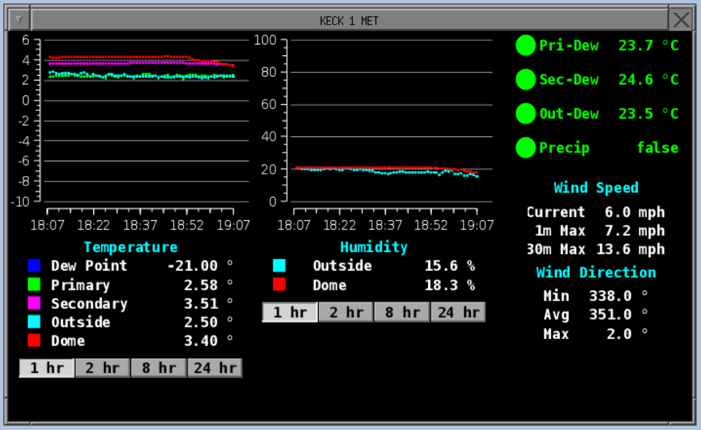

# FACSUM and XMET

FACSUM and XMET are two simple status displays intended to be used with all instruments.  FACSUM gives basic telescope status while XMET gives weather information.

The screenshow above shows an example FACSUM display.  Across the top are various status indicators for the telescope systems.  For typical observations, they should all be green for normal operations.

The center and right regions show various standard telescope information (RA, Dec, El, Az, etc.).

The bottom row of display has several sections

* The leftmost box has instrument and pointing information.
    * INST: The selected instrument (MOSFIRE in the example above).
    * PO: The pointing origin (REF in the example above).
* The next box to the right shows rotator information
    * Rot Mode: The rotator mode which is typically either "Stationary", "Position Angle", or "Vertical"
    * Sky PA: This shows the position angle on sky (typically of the instrument slit) if the mode is "Position Angle".  In other modes, this number has other meanings.  For example, in vertical angle mode, a "Sky PA" of 0 means the slit is oriented in elevation.
    * Drive: This is the physical angle of the drive.  It is unique t each instrument and it does not wrap (i.e. it may not go 0-360).
* The right hand box contains information on ACS.

XMET (or just MET) shows weather information.  The most important values for observers are the 4 colored balls next to the dew point differential and precipitation values in the upper right.  If any temperature is within 2 degrees C of the dew point, then that indicator turns red.  Within 5 C, the indicator is yellow.  If the dew point differential is more than 5 C, the indicator is green.

If any indicator is red, the OA is supposed to close the dome.  To open after a closure, those indicators must all be out of the red for 30 minutes.  The OA has several conditions which must also be met before opening, this is only one of them.
